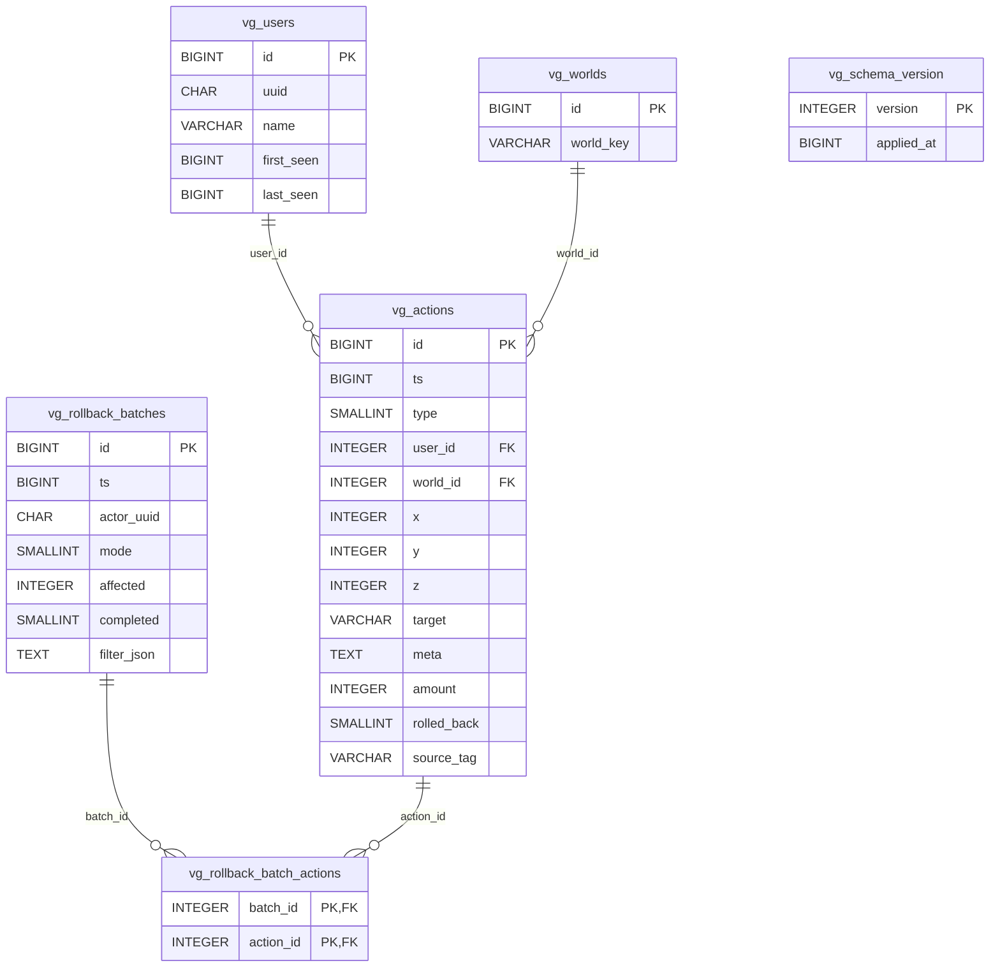

# VonixGuardian — Database Reference

**Version:** 1.0.0
**Schema version:** 2 (see `vg_schema_version`)
**Source of truth:** `core/src/main/java/network/vonix/guardian/core/storage/Schema.java`

This document describes the on-disk schema VonixGuardian uses across its three
supported JDBC backends (SQLite, MySQL, PostgreSQL), the per-backend
differences, and the operational procedures (queries, backup, restore, purge)
that operators most often need.

---

## 1. Overview

VonixGuardian persists everything it tracks in a small, denormalised JDBC schema
made up of **eight database objects** (3 entity tables, 4 indexes on the main
action table, and 2 rollback-audit tables, plus a tiny schema-version table —
eight first-class objects in total):

| # | Object                       | Kind   | Purpose |
|---|------------------------------|--------|---------|
| 1 | `vg_users`                   | table  | UUID/name lookup, first/last seen timestamps |
| 2 | `vg_worlds`                  | table  | Interns world keys to small integer IDs |
| 3 | `vg_actions`                 | table  | The main append-only audit log |
| 4 | `vg_actions_pos`             | index  | `(world_id, x, z, y, ts)` — area lookups |
| 5 | `vg_actions_user_t`          | index  | `(user_id, ts)` — per-user history |
| 6 | `vg_actions_type_t`          | index  | `(type, ts)` — type filters |
| 7 | `vg_actions_ts`              | index  | `(ts)` — time-only scans + purge |
| 8 | `vg_rollback_batches`        | table  | Crash-recovery audit of rollback ops |
| – | `vg_rollback_batch_actions`  | table  | Many-to-many: batch ↔ affected actions |
| – | `vg_schema_version`          | table  | Records the applied schema version (currently 2) |

The DDL is **dialect-aware but additive**: every statement is
`CREATE TABLE IF NOT EXISTS` / `CREATE INDEX IF NOT EXISTS`, so re-running
schema initialisation on an existing database is always a no-op.

---

## 2. Schema

### 2.1 `vg_users` — known players

| Column      | Type            | Constraints                       |
|-------------|-----------------|-----------------------------------|
| `id`        | auto-increment* | **PRIMARY KEY**                   |
| `uuid`      | `CHAR(36)`      | `NULL`, `UNIQUE`                  |
| `name`      | `VARCHAR(64)`   | `NOT NULL`, `UNIQUE`              |
| `first_seen`| `BIGINT`        | `NOT NULL` (epoch millis)         |
| `last_seen` | `BIGINT`        | `NOT NULL` (epoch millis)         |

*`id` is `INTEGER PRIMARY KEY AUTOINCREMENT` on SQLite,
`BIGINT PRIMARY KEY AUTO_INCREMENT` on MySQL, and `BIGSERIAL PRIMARY KEY` on
PostgreSQL — the column is treated as a 64-bit signed integer everywhere.

`uuid` is nullable to permit legacy / console / non-player principals. Both
`uuid` and `name` are uniquely indexed.

### 2.2 `vg_worlds` — interned world keys

| Column      | Type           | Constraints              |
|-------------|----------------|--------------------------|
| `id`        | auto-increment*| **PRIMARY KEY**          |
| `world_key` | `VARCHAR(96)`  | `NOT NULL`, `UNIQUE`     |

`world_key` is the platform-supplied world identifier (e.g. on Paper this is
`world.getKey().toString()` — `"minecraft:overworld"`). The column is named
`world_key` rather than `key` to avoid the MySQL reserved word — see the
"Backend differences" section below.

### 2.3 `vg_actions` — the audit log

This is the hot table. Every block change, container access, kill, command,
chat line etc. lands here as one row.

| Column        | Type            | Constraints                       |
|---------------|-----------------|-----------------------------------|
| `id`          | auto-increment* | **PRIMARY KEY**                   |
| `ts`          | `BIGINT`        | `NOT NULL` (epoch millis)         |
| `type`        | `SMALLINT`      | `NOT NULL` (ActionType ordinal)   |
| `user_id`     | `INTEGER`       | `NOT NULL` → `vg_users.id`        |
| `world_id`    | `INTEGER`       | `NOT NULL` → `vg_worlds.id`       |
| `x`           | `INTEGER`       | `NOT NULL`                        |
| `y`           | `INTEGER`       | `NOT NULL`                        |
| `z`           | `INTEGER`       | `NOT NULL`                        |
| `target`      | `VARCHAR(192)`  | `NOT NULL` (block id / item / arg)|
| `meta`        | `TEXT`          | `NULL` (JSON sidecar)             |
| `amount`      | `INTEGER`       | `NOT NULL DEFAULT 1`              |
| `rolled_back` | `TINYINT`/`SMALLINT` | `NOT NULL DEFAULT 0` (boolean) |
| `source_tag`  | `VARCHAR(64)`   | `NULL` (plugin tag, e.g. `mcMMO`) |

Indexes (declared by `Schema.ddlFor`):

| Index name           | Columns                       | Used for                          |
|----------------------|-------------------------------|-----------------------------------|
| `vg_actions_pos`     | `(world_id, x, z, y, ts)`     | area lookups, rollback scans      |
| `vg_actions_user_t`  | `(user_id, ts)`               | per-user history (`/vg lookup u:`)|
| `vg_actions_type_t`  | `(type, ts)`                  | per-type filters                  |
| `vg_actions_ts`      | `(ts)`                        | time scans, purge, retention      |

The foreign-key references to `vg_users` and `vg_worlds` are **logical**, not
declared as `FOREIGN KEY` constraints — VonixGuardian manages the IDs
internally and skips the DDL constraint so cross-backend behaviour is
identical. `user_id` / `world_id` are plain `INTEGER` everywhere (not BLOBs).

### 2.4 `vg_rollback_batches` — crash-recovery audit (v2)

Recording every rollback/restore so an interrupted operation can be reconciled.

| Column       | Type            | Constraints                |
|--------------|-----------------|----------------------------|
| `id`         | auto-increment* | **PRIMARY KEY**            |
| `ts`         | `BIGINT`        | `NOT NULL` (start time)    |
| `actor_uuid` | `CHAR(36)`      | `NULL` (console = NULL)    |
| `mode`       | `SMALLINT`      | `NOT NULL` (rollback/restore enum)|
| `affected`   | `INTEGER`       | `NOT NULL` (row count)     |
| `completed`  | `TINYINT`/`SMALLINT` | `NOT NULL DEFAULT 0` (boolean) |
| `filter_json`| `TEXT`          | `NULL` (serialised QueryFilter)|

Index: `vg_rollback_batches_ts ON (ts)`.

### 2.5 `vg_rollback_batch_actions` — batch membership (v2)

| Column      | Type      | Constraints                                        |
|-------------|-----------|----------------------------------------------------|
| `batch_id`  | `INTEGER` | `NOT NULL`, part of composite PK → `vg_rollback_batches.id` |
| `action_id` | `INTEGER` | `NOT NULL`, part of composite PK → `vg_actions.id`          |

**Primary key:** `(batch_id, action_id)`.

### 2.6 `vg_schema_version` — applied version

| Column       | Type      | Constraints           |
|--------------|-----------|-----------------------|
| `version`    | `INTEGER` | **PRIMARY KEY**       |
| `applied_at` | `BIGINT`  | `NOT NULL` (epoch ms) |

Currently holds a single row: `version = 2`.

### 2.7 ER diagram



---

## 3. Backend differences

All three backends run the **same logical schema**. Differences are confined to
auto-increment syntax, the boolean column type, the connection-management
strategy, and a handful of identifier-quoting concerns.

### 3.1 SQLite (default)

* **Single file** on disk — `vonixguardian.db` (path is configurable).
* **One** `java.sql.Connection`, with all writes (and reads) serialised through
  a `ReentrantLock` inside `SqliteDao`. SQLite's writer is process-wide
  single-threaded anyway, so a pool would buy nothing and a single lock is
  simpler and faster.
* `id` columns: `INTEGER PRIMARY KEY AUTOINCREMENT`.
* Booleans (`rolled_back`, `completed`) stored as `TINYINT` (0/1).
* No external service to install — ideal for single-server deployments.

### 3.2 MySQL (beta)

* Pooled via **HikariCP** (`MysqlDao` constructs a `HikariDataSource` from the
  JDBC URL in `GuardianConfig`).
* `id` columns: `BIGINT PRIMARY KEY AUTO_INCREMENT`.
* `user_id` / `world_id` are plain **`INTEGER` columns** referencing the user
  and world tables — not BLOBs or UUID columns. The original UUID lives once
  in `vg_users.uuid`.
* `key` is a reserved word in MySQL; the world-table column is named
  `world_key` to keep the DDL portable without needing back-tick quoting.
  Generated queries similarly avoid bare reserved words; where `type` appears
  as a column (which is fine unquoted in MySQL but reserved in some other
  contexts) the compiler treats it as a known fixed identifier
  (`QueryCompiler.ALLOWED_COLUMNS`).
* Booleans stored as `TINYINT`.

### 3.3 PostgreSQL (beta)

* Pooled via **HikariCP** (`PostgresDao` — same shape as `MysqlDao`).
* `id` columns: `BIGSERIAL PRIMARY KEY`.
* Booleans use `SMALLINT` rather than `TINYINT` (Postgres has no `TINYINT`).
* `TEXT` columns are unbounded in Postgres, as expected — same DDL string,
  different storage semantics under the hood.
* Identifier quoting differs from MySQL (Postgres uses double quotes, MySQL
  uses back-ticks), but VonixGuardian's DDL and generated queries deliberately
  avoid reserved words entirely so no per-dialect quoting is needed at runtime.

---

## 4. Direct SQL examples

These run against any backend (modulo dialect-specific literal syntax). They
are intended for ad-hoc operator use against a read replica or a backup; the
plugin itself uses the same indexes via `QueryCompiler`.

**A user's last 100 actions** (look up `user_id` first):

```sql
SELECT id FROM vg_users WHERE name = 'Steve';
-- then:
SELECT id, ts, type, world_id, x, y, z, target, rolled_back
  FROM vg_actions
 WHERE user_id = 42
 ORDER BY ts DESC
 LIMIT 100;
```

**Count actions by type in the last 24 hours** (epoch millis):

```sql
SELECT type, COUNT(*) AS n
  FROM vg_actions
 WHERE ts >= (1000 * (EXTRACT(EPOCH FROM NOW())::BIGINT - 86400))   -- Postgres
 GROUP BY type
 ORDER BY n DESC;
```

(SQLite: `WHERE ts >= (strftime('%s','now') - 86400) * 1000`. MySQL:
`WHERE ts >= (UNIX_TIMESTAMP() - 86400) * 1000`.)

**Unrolled actions in a region** (a 32×32 column around 100,?,200 in the
overworld):

```sql
SELECT a.id, a.ts, u.name, a.type, a.x, a.y, a.z, a.target
  FROM vg_actions a
  JOIN vg_users  u ON u.id = a.user_id
  JOIN vg_worlds w ON w.id = a.world_id
 WHERE w.world_key = 'minecraft:overworld'
   AND a.x BETWEEN 84  AND 116
   AND a.z BETWEEN 184 AND 216
   AND a.rolled_back = 0
 ORDER BY a.ts DESC
 LIMIT 500;
```

(Uses the `vg_actions_pos` index — leading `world_id`, then `x`, `z`.)

**Active / incomplete rollback batches** (e.g. after a crash):

```sql
SELECT id, ts, actor_uuid, mode, affected
  FROM vg_rollback_batches
 WHERE completed = 0
 ORDER BY ts DESC;
```

**Rows touched by a specific batch:**

```sql
SELECT a.*
  FROM vg_rollback_batch_actions ba
  JOIN vg_actions a ON a.id = ba.action_id
 WHERE ba.batch_id = 17;
```

---

## 5. Backup

### 5.1 SQLite

Two options:

1. **Cold copy (simplest, safest).** Stop the server, then copy
   `vonixguardian.db` (and any `-wal` / `-shm` sidecars) to a backup
   location. Restart.

   ```sh
   /vg-server stop
   cp plugins/VonixGuardian/vonixguardian.db /backups/vg-$(date +%F).db
   /vg-server start
   ```

2. **Online backup (no downtime).** Use the SQLite Online Backup API via the
   `sqlite3` CLI — it co-operates with VonixGuardian's writer:

   ```sh
   sqlite3 plugins/VonixGuardian/vonixguardian.db \
     ".backup '/backups/vg-$(date +%F).db'"
   ```

   This is safe while the server is running because the SQLite Online Backup
   API copies pages under a shared lock.

### 5.2 MySQL

Use `mysqldump` with `--single-transaction` to get a consistent snapshot
without locking writers:

```sh
mysqldump --single-transaction --quick --routines \
  -u guardian -p vonixguardian > /backups/vg-$(date +%F).sql
```

Add `--master-data=2` or `--source-data=2` if you need point-in-time recovery
via binary logs.

### 5.3 PostgreSQL

Use `pg_dump` (which is transactionally consistent by default):

```sh
pg_dump --format=custom --no-owner --single-transaction \
  -U guardian -d vonixguardian \
  -f /backups/vg-$(date +%F).dump
```

---

## 6. Restore

Symmetric to backup. **Always stop the server first.**

### 6.1 SQLite

```sh
/vg-server stop
cp /backups/vg-2026-06-28.db plugins/VonixGuardian/vonixguardian.db
/vg-server start
```

### 6.2 MySQL

```sh
mysql -u guardian -p vonixguardian < /backups/vg-2026-06-28.sql
```

### 6.3 PostgreSQL

```sh
pg_restore --clean --if-exists --no-owner \
  -U guardian -d vonixguardian /backups/vg-2026-06-28.dump
```

On first start after restore, VonixGuardian re-runs `Schema.createTables`,
which is a no-op against an existing schema (everything is `IF NOT EXISTS`).
The `vg_schema_version` row is left alone.

---

## 7. Retention and purge

### 7.1 In-game / console command

Use `/vg purge` to delete rows older than a time bound. The command is
documented in [`USAGE.md`](USAGE.md); the relevant safety knobs live in
`config.json`:

```json
"purge": {
  "minAgeSecondsConsole": 86400,
  "minAgeSecondsInGame":  2592000
}
```

* `purge.minAgeSecondsConsole` (default **1 day**) — floor for purges issued
  from the server console / RCON.
* `purge.minAgeSecondsInGame` (default **30 days**) — stricter floor for
  purges issued by an in-game operator.

`PurgeEngine` enforces both floors: an attempt to purge anything younger than
the applicable floor is refused before the `DELETE` is issued.

### 7.2 Manual SQL purge

If you need to free disk space outside of the command (e.g. emergency cleanup,
or rotating an archive table), you can `DELETE` directly:

```sql
-- ⚠ READ THE WARNING BELOW BEFORE RUNNING.
DELETE FROM vg_actions
 WHERE ts < (1000 * (EXTRACT(EPOCH FROM NOW())::BIGINT - 7776000));  -- 90 days
```

> **⚠ WARNING — rollback batches.**
> `vg_rollback_batch_actions` references `vg_actions.id`. If you delete
> action rows that are still referenced by a batch (`completed = 0` or a
> recent completed batch you might still want to inspect), the batch's
> membership table will hold dangling IDs. The plugin treats missing actions
> as a no-op on reconciliation, but you will lose forensic detail.
>
> Safe manual purge order is:
> 1. Delete (or archive) rows from `vg_rollback_batch_actions` whose
>    `batch_id` belongs to old, **completed** batches you no longer need.
> 2. Delete the matching rows from `vg_rollback_batches`.
> 3. Then delete from `vg_actions`.
>
> Always purge through `/vg purge` when possible — it handles this ordering
> for you and respects the configured safety floors.

After a large manual purge, consider `VACUUM` (SQLite / Postgres) or
`OPTIMIZE TABLE` (MySQL) to reclaim space.

---

## See also

* [`docs/MIGRATION.md`](MIGRATION.md) — schema version history and how
  upgrades are applied.
* [`docs/USAGE.md`](USAGE.md) — operator commands, including `/vg lookup`,
  `/vg rollback`, and `/vg purge`.
